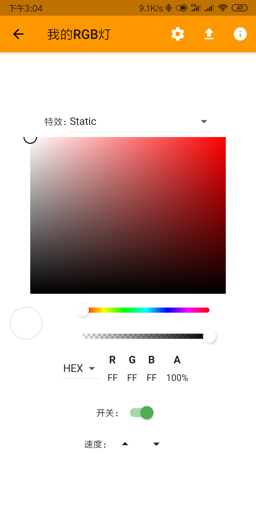

# esp8266-RGB-WS2812
esp8266 RGB灯

* https://github.com/kitesurfer1404/WS2812FX
* https://github.com/adafruit/Adafruit_NeoPixel

### app操作界面 

## 手机APP 
- app下载地址：https://github.com/OpenIoTHub/OpenIoTHub/releases (安装好次程序就可以给刷好本固件程序的设备配网并发现控制了，如果想外网访问请使用下面的软件)
- 如果你想外网访问请安装此软件配套的内外管理程序，地址：https://github.com/OpenIoTHub/GateWay
- 程序安装和使用参考：https://www.jianshu.com/p/112c1583889f
